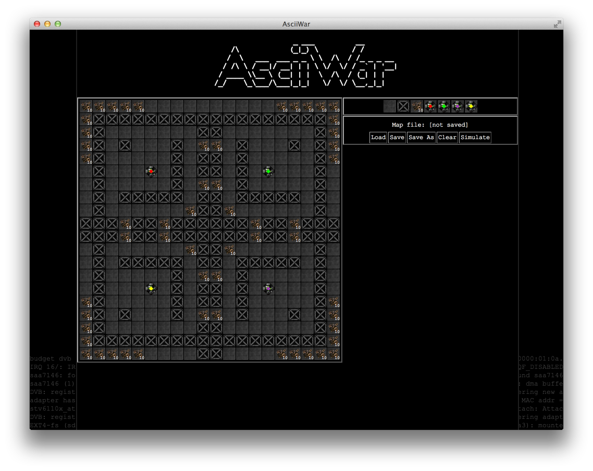
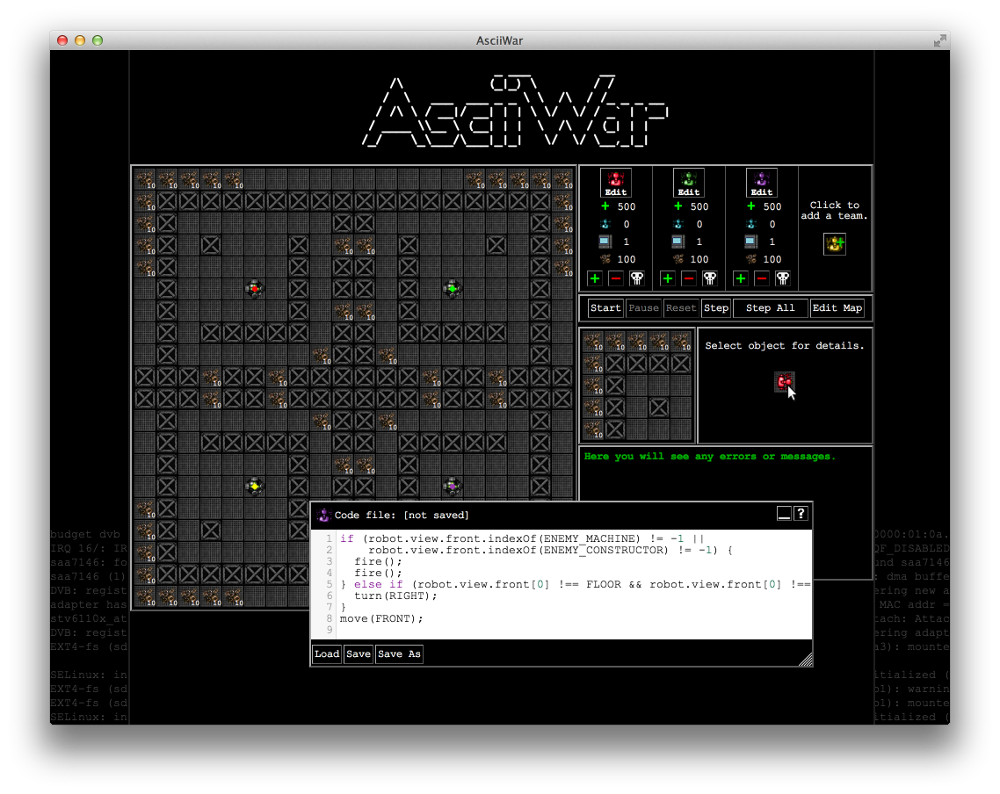
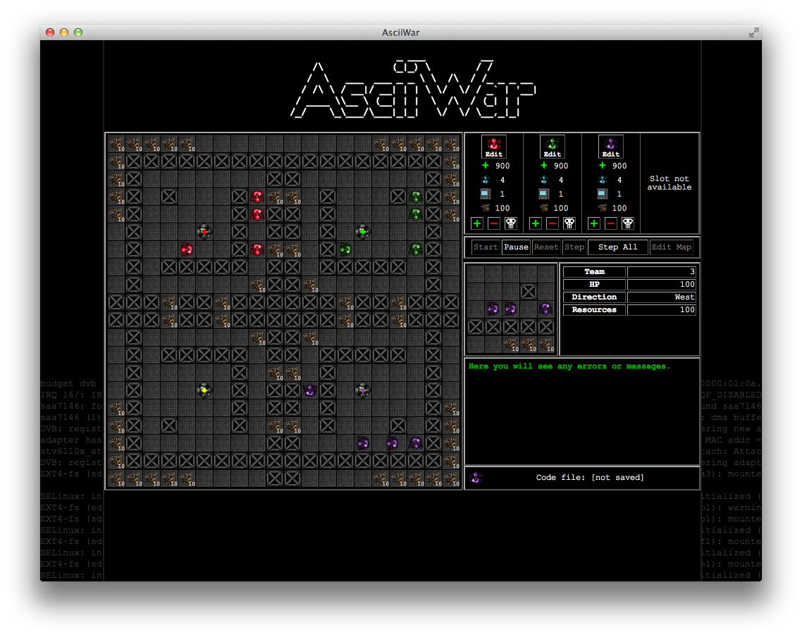

# AsciiWar

#### About the project

Main goal of the project is to create a multiplayer game for programmers entirely in JavaScript.
First part of the project, the *Simulator*, allows the player to simulate the gameplay and test how the created AI behaves. It is also a nice sandbox that allows the player to tweak and improve his code.
Server-side, the second part of the project, is still in progress.

#### How to run

This project uses [node-webkit](https://github.com/rogerwang/node-webkit). To run the app you will have to download the node-webkit binary and launch it with the *src* directory as a parameter (as it contains package.json file).
Packaged binaries of AsciiWar will be available soon.

#### How to Play

The main goal of the game is to code a team of robots that will help them achieve victory. Your team of robots can win in two ways: destroy all other machines or destroy their constructors, which will instruct the machines to self-destruct!

**Please check [**src/help.html**](http://htmlpreview.github.io/?http://github.com/sulewicz/awars/blob/standalone/src/help.html) file for detailed instructions.**

#### What the robots can do?

Currently the robots can perform following operations:

* move	

  Basic function used for moving the robot around the map. Possible arguments are FRONT, RIGHT, BACK or LEFT.

 * turn	
   
   Basic function used for turning the robot in a particular direction. Possible arguments are FRONT, RIGHT, BACK or LEFT.	
   
 * melt	
   
   This will command the machine to melt the wall in front of it.
   
 * fire
   
   Machine will fire its laser in front of it. The range of the laser are 3 tiles. One shot takes 25 HP.
 
 * hit

   Robot will do a meele attack. The range is of course one tile. One hit takes 50 HP.
   
 * build
   The machine will build a wall in front of itself, if the tile is not occupied by anything else already. Costs 5 resources.

 * scan
   
   This will trigger a scan of the environment. Next turn the machine can check the result of the scan in this.scan_result field.
   
 * convert	
 
   The robot will attempt to convert the enemy machine in front of it on its own side. The chances of succesfull convertion are 33%.
   
 * replicate
  
   If the team has enough resources, the constructor will produce a new robot. This costs 100 resources. Maximal number of machines in the team is 20. Please note that machine may not be created if all tiles around the constructor are occupied, however in such case resources won't be subtracted.
 
 * repair
 
   If the team has enough resources, the machine will aut-repair itself and regain hit points. The cost of repair is 30 resources.

